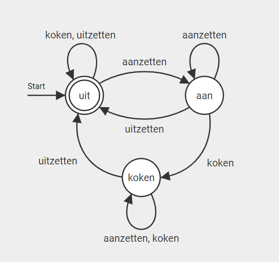
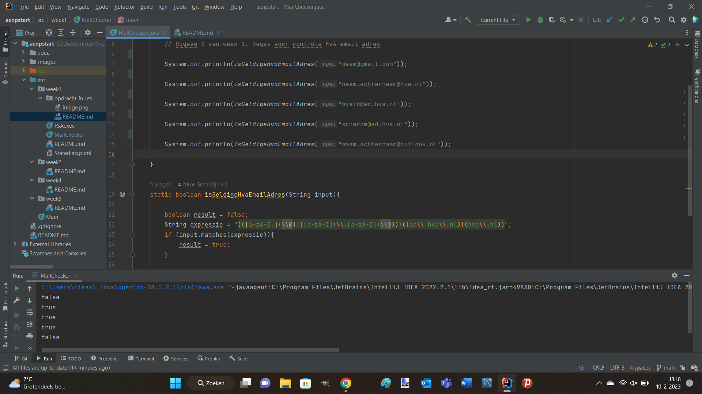

# # Dit is de readme voor de 1e opdracht van week 1

beschrijving van de bovenstaande afbeelding: 

het diagram voor een waterkoker, met de standen uit, aan en koken

 
 

uitleg van FSAexec.java : 

er wordt een object aangemaakt, die gaat dan in een flaci diagram
die door middel van een multidimensional array de opgegeven 
reeks karakters uit voert in de gegeven volgorde

 
 

uitleg van de MailChecker opdracht : 

 

er wordt gecheckt of er voor de @ een voornaam.achternaam of hvaid is
daarna wordt er gecheckt of er na de @ ad.hva.nl of hva.nl staat, zo
ja dan returned hij true en anders returned hij false

 
 