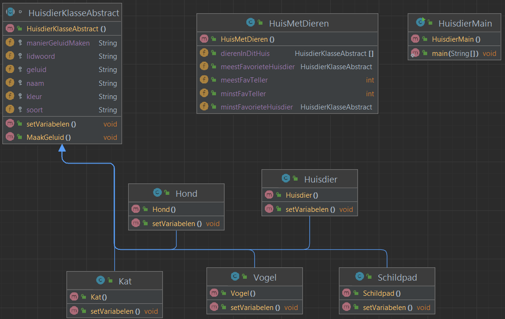
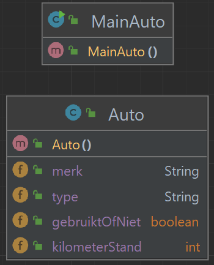

# Readme voor week 2

 
beschrijving van de bovenstaande afbeelding: 

Dit is het overzicht van de UML voor de huisdieropdracht
er zijn 5 verschillende dieren gebaseerd op een abstracte template,
die gaan dan in een huis dat bestaat uit een array met wat extra variabelen.
en dan doe ik er shit mee vanuit de main.

   

 
beschrijving van de bovenstaande afbeelding: 

er is een klasse voor de auto's en een main om er wat mee te doen

