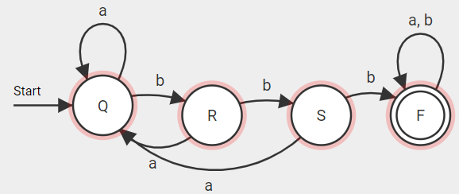
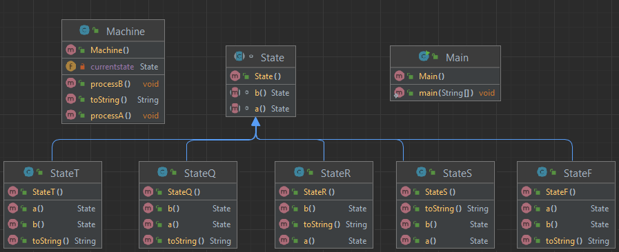

# Dit is de readme voor week 4

Schrijf je verslag voor week 4 (en week 3 roostervrij)

in de bovenstaande afbeelding zie je het schema
dat ik heb gemaakt voor de opdracht

dit is de ULM van de RSQF opdracht

 
ik het hier een abstracte van state met abstracte functies 5
verschillende states gemaakt die ieder de setvariabelen functie
overschrijven naar hun eige variabelen. dit allemaal samen maakt met de 
klasse Machine een statemachine die via de main een random reeks aan 
inputs krijgt die hij dan door de statemachine zal halen.

