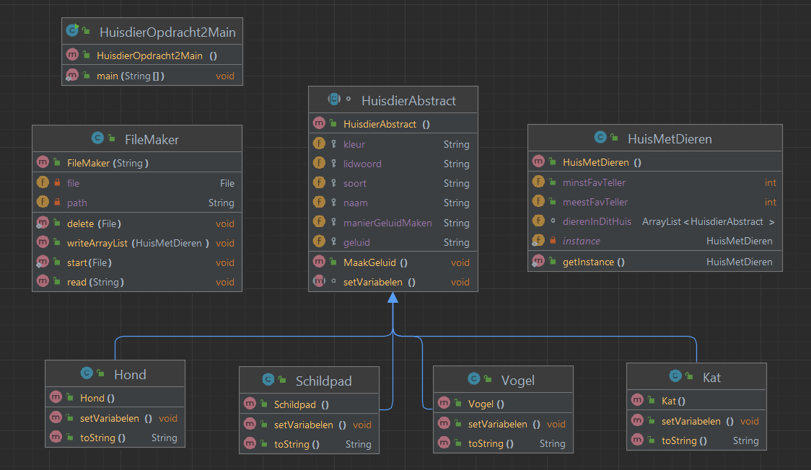

# Dit is de readme voor week 5

huisdieropdracht v2:
  

van een abstracte voor huisdier 4 verschillende dieren gemaakt die dan in een array worden gegooid.
via de main een filemaker gooi ik ze in een array om die da op te slaan in een bestand.
